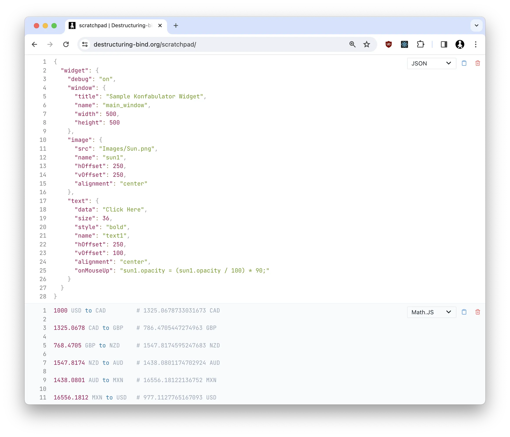

# Scratchpad

Scratchpad is a small web app that allows you to store snippets & miscellaneous notes as "blocks" in your browser's
local storage. They never leave your machine (unless you want to sync them to your Google Drive). Many file formats
are supported, and it will do syntax coloring and pretty-print formatting (especially useful for JSON).



[Math.JS](https://mathjs.org/docs/index.html) is integrated as a file type, giving a capable calculator functionality
with currency conversion (FX rates provided by an ECB API).

Each block has a toolbar of options, and you can right-click to get a context menu allowing you to alter settings
and sync to Google.

### Keyboard shortcuts

On MacOS,

&nbsp;&nbsp;<kbd>⌘</kbd> <kbd>/</kbd> - Search

&nbsp;&nbsp;<kbd>⌘</kbd> <kbd>ENTER</kbd> - Add new block

&nbsp;&nbsp;<kbd>⌘</kbd> <kbd>.</kbd> - Base64-decode selected text

For Windows/Linux, use <kbd>CTRL</kbd> rather than <kbd>⌘</kbd>.

Go to https://www.destructuring-bind.org/scratchpad to see it in action.

## Running locally

You must have Node 20 and Yarn installed. To begin:

```console
yarn install
yarn dev
```

If you want to test Sync behaviour, you will need to create a project in [Google Developer Console](https://console.cloud.google.com/apis/credentials) and create an OAuth 2.0 Client ID. Stop the server, and restart with:

```console
export VITE_GOOGLE_API_CLIENT_ID=<your-google-api-client-id>
yarn dev
```

## License

### MIT License

Copyright (c) 2023 Richard Hull

Permission is hereby granted, free of charge, to any person obtaining a copy
of this software and associated documentation files (the "Software"), to deal
in the Software without restriction, including without limitation the rights
to use, copy, modify, merge, publish, distribute, sublicense, and/or sell
copies of the Software, and to permit persons to whom the Software is
furnished to do so, subject to the following conditions:

The above copyright notice and this permission notice shall be included in all
copies or substantial portions of the Software.

THE SOFTWARE IS PROVIDED "AS IS", WITHOUT WARRANTY OF ANY KIND, EXPRESS OR
IMPLIED, INCLUDING BUT NOT LIMITED TO THE WARRANTIES OF MERCHANTABILITY,
FITNESS FOR A PARTICULAR PURPOSE AND NONINFRINGEMENT. IN NO EVENT SHALL THE
AUTHORS OR COPYRIGHT HOLDERS BE LIABLE FOR ANY CLAIM, DAMAGES OR OTHER
LIABILITY, WHETHER IN AN ACTION OF CONTRACT, TORT OR OTHERWISE, ARISING FROM,
OUT OF OR IN CONNECTION WITH THE SOFTWARE OR THE USE OR OTHER DEALINGS IN THE
SOFTWARE.
